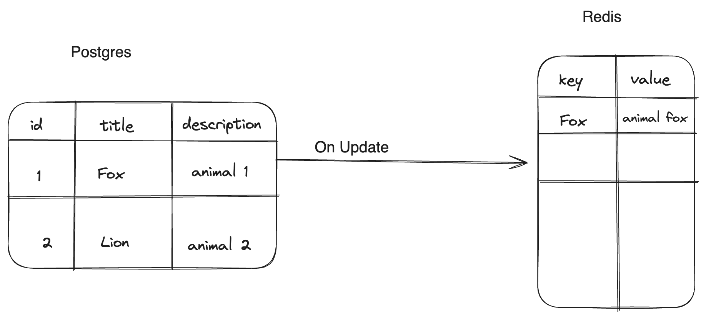

**Table of Contents**

1.  General scope of the project with some images

    a. Talk about how we need the redis url and the table name, column key and value

2.  Install Pgrx and Postgres db
3.  Talks about hooks and their basic setup
4.  Setting up custom variables using GUC
5.  Obtaining Redis key- Planner Hook

6.  Obtaining Redis value - Executor end

7.  Background writer and shared memory

8.  Running and testing the code

## Objective

The main objective of this project was actually to understand some postgres internal and also get handy with rust via building a postgress extension that allows the tracking of a particular table column and using the values in that column to populate our redis store.



The main scope is to track any update to a specific table, e.g using the image above, We have a table with three columns `id`, `title` and `description`. Let assume we want to track this table, and want to build a redis store where column `title` values are the keys and column `description` values will be the redis values

```sql
Update Test SET description = 'animal fox' where title = 'Fox'
```

the following are the main creterias:

1. identify table to be tracked e.g `test`
2. identify the columns in the table that will server has the redis keys and values
3. whenever we have an update query that has our table in it and the where clause contains our key column, obtain the update and send over to redis

## Install Pgrx and Postgres db

To get started let install postgred db; the easiest way to install postgred db without any complicated issues for the project is to install via [postgres.app](https://postgresapp.com/).

Once postgres db is installed, we can go ahead to install [pgrx](https://github.com/pgcentralfoundation/pgrx), first make sure you have `rust` and `cargo` installed.

```sh
$ cargo install --locked cargo-pgrx
```

once the installation is done , we can then initialize pgrx to properly configure the pgrx development environment

```sh
$ cargo pgrx init
```

**Note**: If you are a mac user and you have any issue with the initialization try running `brew install pkg-config icu4c`

Once the initialization is done , we can go ahead to create the project workspace

```sh
$ cargo pgrx new postgres-redis
```

this initialize the workspace with a boilerplate to get started with.

```sh
$ ls postgres-redis
Cargo.toml postgres_redis.control sql src
```

For more details about pgrx command check [here](https://github.com/pgcentralfoundation/pgrx/blob/develop/cargo-pgrx/README.md#first-time-initialization)

### Setting up custom variables using GUC

Based on the criteria we've set for this extension implementation we need a way to set up the required configs needed to get the extension working.

We therefore make use of Grand Unified configuration (Guc). Guc enables us to control posgress from different levels:

```
PGC_INTERNAL
PGC_POSTMASTER
PGC_SIGHUP
PGC_SU_BACKEND
PGC_BACKEND
PGC_SUSET
PGC_USERSET
```

For this project, we would love to enable postgres control from `PGC_USERSET`, by control, i mean setting up config/env variables that controls how postgres behaves. Normallly, postgres config can be set before initializing your db via `postgresql.conf` , but with the `PGC_USERSET` we are flexible and dynamic enough, such that we can set a config dynamically via

```sql
ALTER SYSTEM SET postgres_redis.table TO 'test';
```

This will update `postgresql.auto.conf` with this new update and the config get updated at run time.

To know more about the other control levels in clear details checkout [GucContext](https://github.com/postgres/postgres/blob/0d30e48c2578a6857aa2869f1b2696b6eb5fef68/src/include/utils/guc.h#L37-L38)

Going ahead with the specification above, we will create a new file called `gucs.rs` under `src/`. Each config variable defintion follow this basic steps

```rs
use pgrx::*;
use std::ffi::CStr;

pub static PGD_REDIS_URL: GucSetting<Option<&'static CStr>> =
    GucSetting::<Option<&'static CStr>>::new(None);


pub fn init() {
    GucRegistry::define_string_guc(
        name: "postgres_redis.redis_url",
        short_description: "Redis URL",
        long_description: "The url of the redis server to send the data to.",
        setting: &PGD_REDIS_URL,
        context: GucContext::Userset, // defined the control level here
        flags: GucFlags::default(),
    );
}


```

First we import the neccessary packages; for `std::ffi:cstr`, since the extension is also interacting with C code from postgres via an abstraction in `pgrx` we will make use of some `Foreign function interface` utils alot and one of them is the null pointer char `char *` in c which is now represented has `CStr`.

We create a static variable and a static lifetime for each of this config variables and the declare a initialization function to define each of the config variable via `GucRegistry::define_string_guc` this function will be called for each of the propose variables and in it we declare the `name` of the variable and how it should be specified in the config file, also contains the description of the variable, `setting` to point the variable to our defined static variable, also we specified the context to which this variable can be created.

```rs
pub static PGD_REDIS_URL: GucSetting<Option<&'static CStr>> =
    GucSetting::<Option<&'static CStr>>::new(None);

pub static PGD_REDIS_TABLE: GucSetting<Option<&'static CStr>> =
    GucSetting::<Option<&'static CStr>>::new(None);

pub static PGD_KEY_COLUMN: GucSetting<Option<&'static CStr>> =
    GucSetting::<Option<&'static CStr>>::new(None);

pub static PGD_VALUE_COLUMN: GucSetting<Option<&'static CStr>> =
    GucSetting::<Option<&'static CStr>>::new(None);


pub fn init() {
    GucRegistry::define_string_guc(
        "postgres_redis.redis_url",
        "Redis URL",
        "The url of the redis server to send the data to.",
        &PGD_REDIS_URL,
        GucContext::Userset,
        GucFlags::default(),
    );
    GucRegistry::define_string_guc(
        "postgres_redis.redis_table",
        "Table name",
        "The table name to track for changes.",
        &PGD_REDIS_TABLE,
        GucContext::Userset,
        GucFlags::default(),
    );
    GucRegistry::define_string_guc(
        "postgres_redis.key_column",
        "Table column name",
        "The column name whose value will be used as the key in the redis hash.",
        &PGD_KEY_COLUMN,
        GucContext::Userset,
        GucFlags::default(),
    );
    GucRegistry::define_string_guc(
        "postgres_redis.value_column",
        "Table column name",
        "The column name whose value will be used as the value in the redis hash.",
        &PGD_VALUE_COLUMN,
        GucContext::Userset,
        GucFlags::default(),
    );
}
```

Now we have the variables defined, we will discus how to call this variable and make use of them later in this article

## Postgres Hook

If we open the `src/lib.rs` we will see some boilerplate code to get us started. the code import some of the neccessary modules needed and also create a postgres sql function and include a test for us.

For example just using the provided function

```rs
#[pg_extern]
fn hello_postgres_redis() -> &'static str {
    "Hello, postgres_redis"
}
```

`[pg_extern]` is a macro that helps write the sql function query `CREATE OR REPLACE FUNCTION ....` via the `hello_postgres_redis`, but unfortunately we won't discus in details about how to create functions.

Well, we should be able to compile succesfully and initialize our extension and then call the `hello_postgres_redis()` function

build and run the code using pg14

```sh
$ cargo pgrx run pg14

postgres_redis=#
```

and then initialize the extension

```sh
postgres_redis=# create extension postgres_redis;
CREATE EXTENSION
```

`postgres_redis` is the name of our crate library, and then make a call to the sql function

```
postgres_redis=# select hello_postgres_redis();
 hello_postgres_redis
-----------------------
 Hello, postgres_redis
(1 row)

postgres_redis=#
```

The result above is the current state of our code.

Our main focus is to create hooks that helps interfee with our code at different junctions needed;

1. intercept the postgress process during Query planner (before query optimization ), so as to fetch our redis key from the specified table and column
2. Intercept postgress process during executor run, so has to get customize data returned from `select` query
3. intercept postgress process during when the executor is done, to fetch our redis key value
4. intercept postgres process during commit, so has to save the data (key and value) fetched

Don't worry, if your are not cleared each stage of interception,we will discus more about them in subsequent sections of this article.

Before we can start initializing each of the interception stage, we need to setup the basic layout of our hooks

```rs
use pgrx::{prelude::*, register_hook, HookResult, PgHooks};

// define custom data fields here for use accross our hooks
struct PRHook { }

// define custom hooks has method
impl PgHooks for PRHook { }

static mut HOOK: PRHook = PRHook {} // create hook variable

// function to register our hook and initialize various utilities needed
pub unsafe extern "C" fn _PG_init() {
    // intializae utilities
    register_hooks(&mut HOOK); // register hook
 }
```

First we created a struct `PRHook` , where we can create various fields that can be passed around in our custom hooks. Custom hooks definition are implemented has method in `impl PgHooks for PRHook`, after which the hooks is initialize and register as hooks in `_PG_init`

For this article, we will need to declare some fields in PRHook to store our custom variables

```rs
struct PRHook {
    update_receiver: Option<UpdateDestReceiver>, // store data from executor end intersecting update queries
    where_clause_receiver: Option<(String, String)>, // store values to be use has redis key
    table: Option<String>, // store the table name extracted from the config
    key_column: Option<String>,  // store the column  whose value will be use as redis key
    value_column: Option<String>, // store the column name whose value will be use as redis value
    keep_running: bool, // flag if table name is found or not in the query processs
}
```

and here is the blueprint of our hooks, we will discus more about them in subsequent section

```rs
impl PgHooks for PRHook {
    fn planner() {}
    fn excutor_end() {}
    fn commit() {}
    fn abort() {}
}
```

Now we have basic structure of the hooks that will be implemented to get the work done. Next we need to create the Hook struct variable and then initialize it in `_PG_init`

```rs
static mut HOOK: PRHook = PRHook {
    update_receiver: None,
    where_clause_receiver: None,
    table: None,
    key_column: None,
    value_column: None,
    keep_running: true,
};
```

and then create a `init` function comprising of fetching the neccessary config variables and then register the hook.

To fetch `Guc` variables we first need to import our `gucs` module and then fetch each of the config variables e.g

```rs
pub mod gucs


unsafe fn init_hook() {
    // check if the env variable is not empty
    if gucs::PGD_REDIS_TABLE.get().is_none() {
        log!("Table name is not set");
        return;
    }

    // the table value which is &str
    let table_name = gucs::PGD_REDIS_TABLE
        .get()
        .unwrap()
        .to_str()
        .expect("table name extraction failed");

    //......... other variables are ectracted the same way has table_name........

    // convert the reference string to a Owned string
    // and store in Hook.table
    HOOK.table = Some(table_name.to_string());

    // register the hook
    register_hook(&mut HOOK);
}
```

The above code block shows how we obtain the config variables and then initialize hook variable using `register_hook`. also note that we make use of `unsafe`; we will use this alot, it helps us to work with raw pointer alot.

We can now formally intitialize how `guc` variable and `init_hook`

```rs
#[pg_guard]
pub unsafe extern "C" fn _PG_init() {
    gucs::init();
    init_hook();
}
```

`unsafe extern "C"` function is to tell that this function will be called in a c environment, after it’s compiled to a shared library and linked from C. To learn more about unsafe checkout this rust book [chapter](https://doc.rust-lang.org/book/ch19-01-unsafe-rust.html)

## Obtaining Redis key - Planner Hook

We've set up the structure, right time to start implementing our hooks method. First we need to fetch the value from the cloumn we specify to be our key column. What do we mean by key column and whats the visual reperesentation of this?

I will explain this using the example we started with from the begining

```sql
Update Test SET description = 'animal fox' where title = 'Fox'
```

imagine we've chose `title` to be the column we want its value to be our key, so whenever there is an update, we want to intercept this query has shown above hence we need a way to

- identify if the column we want is present in the query
- if the column is detected in the query, whats it value to be use has key e.g `Fox` is the value and will be our redis key.
- then store the column name and it value in `where_clause_receiver`.
- if column or table not found, we prevent the postgres from processing any code from us.

To achieve the specified steps, we are going to implement a `planner` hook.

```rs
fn planner(
        &mut self,
        parse: PgBox<pg_sys::Query>,
        query_string: *const std::os::raw::c_char,
        cursor_options: i32,
        bound_params: PgBox<pg_sys::ParamListInfoData>,
        prev_hook: fn(
            parse: PgBox<pg_sys::Query>,
            query_string: *const std::os::raw::c_char,
            cursor_options: i32,
            bound_params: PgBox<pg_sys::ParamListInfoData>,
        ) -> HookResult<*mut pg_sys::PlannedStmt>,
    ) -> HookResult<*mut pg_sys::PlannedStmt> {}
```

Don't be boethered about the verbose list of function args and their type, for this implementation our main focus `parse: PgBox<pg_sys::Query>` and `prev_hook` callback.

The `parse` arg is a `Query` type and why are using this, doing query processing, postgres convert each of this query and sub-queries statements to a query tree, this query tree is Data structure defined in [parsenode.h](https://github.com/postgres/postgres/blob/0d30e48c2578a6857aa2869f1b2696b6eb5fef68/src/include/nodes/parsenodes.h#L106-L107)

In this query table we would only be making use of two fields for our exploration

```c
typedef struct Query
{
    List	   *rtable;			/* list of range table entries */
    FromExpr   *jointree;		/* table join tree (FROM and WHERE clauses) */
} Query;
```

The `rtable` fields contain list to table, from here we can detect if the table we specify in our config is present in the query.

The `jointree` contains the data structure neede to generate our key from the Where clauses. The following image depict the structure of the query tree


source: [The internal of postgres](https://www.interdb.jp/pg/pgsql03/01.html)

Focusing on the `* jointree` it contains `FromExpr` node and this contains `quals` node which have `Opexpr` node and then our main aim will be to fetch the `VarExpr` which will be the column name and then we fetch the `CONST` which is our key.

Ok, back to code; First we need to actually check if this query staatment contains our table, create a file `src/utils.rs`. we will create a function that takes in `rtable` and then `table_name` we are looking for

```rs
pub fn is_contain_table(table_lists: *mut List, expected_table_name: &str) -> bool {
    let mut result = false;

    // code goes here

    result
}
```

Since `table_lists` has type `*mut List`, this shows its a raw pointer hence we will need to make use of unsafe to work with this

```rs
pub fn is_contain_table(table_lists: *mut List, expected_table_name: &str) -> bool {
    let mut result = false;
    unsafe {
        let mut length = 0;
        if !table_lists.is_null() {
            length = table_lists.as_ref().unwrap().length;
        }
        for i in 1..=length {
            let table_entry = *rt_fetch(i as u32, table_lists);
            if table_entry.relkind as u8 != RELKIND_RELATION {
                continue;
            }
            let table_data = *table_entry.eref;
            let name = CStr::from_ptr(table_data.aliasname);
            let name = name
                .to_str()
                .expect("Failed to convert Postgres query string for rust");
            if name == expected_table_name {
                result = true;
                break;
            }
        }
    }
    result
}
```

`table_lists.as_ref().unwrap().length` we dereferenc the pointer and get the length of the list and then loop through it, remember we said `rtable` is a list of tables. for subqueries we will have multiple tables (relations), but for our example we should have one.

To get the `rt_fetch` takes in an index and the rtable list. it access the rtable per index and return the table entry `RangeTblEntry`. This a data structure as defined [here](https://github.com/postgres/postgres/blob/0d30e48c2578a6857aa2869f1b2696b6eb5fef68/src/include/nodes/parsenodes.h#L884)

RangeTblEntry , contains several fields describing the tabel entry relation, but we only need 2 field from it.

```c
typedef struct RangeTblEntry
{
    char		relkind;		/* relation kind (see pg_class.relkind) */
    Alias	   *eref;			/* expanded reference names */
} RangeTblEntry;
```

relkind, used to specify the type of table we are trying to work on, the following shows that we only want to work with table of `RELKIND_RELATION` that is `ordinary table`

```rs
if table_entry.relkind as u8 != RELKIND_RELATION {
    continue;
}
```

we have different type of tables from ordinary, secondary , foriegn table to regular table you can find more in [pg_class.h](https://github.com/postgres/postgres/blob/0d30e48c2578a6857aa2869f1b2696b6eb5fef68/src/include/catalog/pg_class.h#L164-L165)

```rs
let table_data = *table_entry.eref;
let name = CStr::from_ptr(table_data.aliasname);
```

we get the `.eref`, an [Alias](https://github.com/postgres/postgres/blob/0d30e48c2578a6857aa2869f1b2696b6eb5fef68/src/include/nodes/primnodes.h#L30-L31) data structure containing an aliasname of the table. This name is converted from raw pointer to c char and then converted to a proper string reference. If this resulted table name is matches our expected table name we set `result` to true else false

The `is_contain_table` can then be imported into `src/lib.rs` and then called inside planner hook

```rs

fn planner(...) {
    self.keep_running = utils::is_contain_table(parse.rtable, self.table.as_ref().unwrap());
    if !self.keep_running {
        return prev_hook(parse, query_string, cursor_options, bound_params);
    }
}
```

if `self.keep_running` end up being false, we call the `prev_hook` this to tell postgres to continue with its normal process.

Now we can confirm if our table is present in the query, let extract the column name and value from the query

```rs
fn planner(...) {
    self.keep_running = utils::is_contain_table(parse.rtable, self.table.as_ref().unwrap());
    if !self.keep_running {
        return prev_hook(parse, query_string, cursor_options, bound_params);
    }

    let jointree = *parse.jointree;
    let quals: *mut pg_sys::Node = jointree.quals;
    let quals_node = eval_const_expressions(std::ptr::null_mut(), quals.cast());
    let mut opexprs = vec![];
    let mut boolexprs = vec![];
    let mut result = None;
    if is_a(quals_node.cast(), NodeTag::T_OpExpr) {
        opexprs.push(quals_node.cast::<OpExpr>());
    }
    if is_a(quals_node.cast(), NodeTag::T_BoolExpr) {
        boolexprs.push(quals_node.cast::<BoolExpr>());
    }
}

```

Recall, we said that our main target is the `quals` Node in jointree, it contains the whereclause. The quals is fetched and then passed into [eval_const_expressions](https://github.com/postgres/postgres/blob/0d30e48c2578a6857aa2869f1b2696b6eb5fef68/src/backend/optimizer/util/clauses.c#L2122-L2123), this is use to optimize the query, it use to reduce constant subexpression such as instead of the query having `2 + 2` it reduces it to `4`

Once that is done, we need to indentify the type of expression Node we are dealing with

e.g The following is `OpExpr`

```sql
Update Test SET description = 'animal fox' where title = 'Fox'
```

and the following is `BoolExpr`

```sql

Update Test SET description = 'animal fox' where title = 'Fox' AND id= 2
```

Hence [is_a](https://github.com/postgres/postgres/blob/0d30e48c2578a6857aa2869f1b2696b6eb5fef68/src/include/nodes/nodes.h#L590-L591) is used to check the type of Node expr we are dealing with, also note that this node is representred as [NodeTag](https://github.com/postgres/postgres/blob/0d30e48c2578a6857aa2869f1b2696b6eb5fef68/src/include/nodes/nodes.h#L17-L18)

```rs

fn planner(...) {
    ........

    while let Some(boolexpr) = boolexprs.pop() {
        let args = (*boolexpr).args;
        let l = &(*args);
        for i in 0..l.length {
            let f = node_fetch(args, i as usize);
            let t = f.cast::<Node>();
            if is_a(t.cast(), NodeTag::T_OpExpr) {
                opexprs.push(t.cast::<OpExpr>());
            } else if is_a(t.cast(), NodeTag::T_BoolExpr) {
                boolexprs.push(t.cast::<BoolExpr>());
            }
        }
    }
}
```

For query statement containing BoolExpr, within is is Opexpr so we loop through the BoolExpr, fetch all the OpExpr until there is no BoolExpr to be evaluated.

Once we have the list of Opexpr needed, now is the type to search through Opexpr and its fields to get what we need

```rs

fn planner(....) {
    ........

    for node in opexprs {
        let op_expr_pointer = node.cast::<OpExpr>();
        let op_expr = *op_expr_pointer;
        let op_number = Oid::from(416);

        // step 1
        if op_expr.opno == op_number || op_expr.opno == Oid::from(TextEqualOperator) {
            // step 2
            let args = op_expr.args;
            let argg = args.as_ref().unwrap();
            let first_cell = argg.elements.add(0);
            let first_value = first_cell.as_ref().unwrap().ptr_value;
            let second_cell = argg.elements.add(1);
            let second_value = second_cell.as_ref().unwrap().ptr_value;
            let mut first_node = first_value.cast::<Node>();
            let second_node = second_value.cast::<Node>();
            // step 3
            if is_a(first_node.cast(), pg_sys::NodeTag::T_RelabelType) {
                let relabel = first_node.cast::<pg_sys::RelabelType>();
                first_node = (*relabel).arg.cast::<pg_sys::Node>();
            }
            // step 4
            if is_a(first_node.cast(), pg_sys::NodeTag::T_Var)
                && is_a(second_node.cast(), pg_sys::NodeTag::T_Const)
            {
                // final code goes here
            }
        }
    }
    result
}
```

Using the commented step to follow up on the code above

**step 1** : [OpExpr](https://github.com/postgres/postgres/blob/0d30e48c2578a6857aa2869f1b2696b6eb5fef68/src/include/nodes/primnodes.h#L531-L550) is a data structure describing the Operator expertion.

```c
typedef struct OpExpr
{
	Expr		xpr;
	Oid			opno;			/* PG_OPERATOR OID of the operator */
	List	   *args;			/* arguments to the operator (1 or 2) */

    .....
} OpExpr;
```

In step 1 will check if the `.opno` is an equal operator which has an oid equivalent to `416` or its Equal to `TextEqualOperator` which has an oid =98. You can view the list of operator and their oid value in [pg_operator.dat](https://github.com/postgres/postgres/blob/0d30e48c2578a6857aa2869f1b2696b6eb5fef68/src/include/catalog/pg_operator.dat#L1-L2)

**step 2**: We access the `.arg` which is a list of arguments to the operator, the [List](https://github.com/postgres/postgres/blob/0d30e48c2578a6857aa2869f1b2696b6eb5fef68/src/include/nodes/pg_list.h#L50-L51) contains a field called elements this contains the actual data we need.

For example `title="Fox"` the elements data structure will store the argument like; `{0=> 'title', 1=>"Fox"}` so we can access them via the index. Note this just a concrete example jsut to make sure the idea is fully passed, since it is need for the next explanation.

Once we access the `.elements` we access the `ptr_value`. note that elements is [ListCell](https://github.com/postgres/postgres/blob/0d30e48c2578a6857aa2869f1b2696b6eb5fef68/src/include/nodes/pg_list.h#L43-L44) data structure. The `ptr_value` obtained for both `first_value` and `second_value` are then converted to a `Node`

**step 3**: Sometime we might have a query statement like `.... where column_integer = "2"` the query process will need to do some kinda type convervsion, it assign this node to `T_RelabelType` and we then go ahead to cast it to the rightful node.

**step 6**: Check if the `fist_node` is a variable and check if the `second_node` is a constant node type.

Lets fetch the variable `first_node`

```rs

fn planner(...) {
    if is_a(first_node.cast(), pg_sys::NodeTag::T_Var)
                && is_a(second_node.cast(), pg_sys::NodeTag::T_Const)
            {

                let var: *mut pg_sys::Var = first_node.cast::<pg_sys::Var>();
                let var_attid: i16 = var.as_ref().unwrap().varattno;
                let varno = var.as_ref().unwrap().varno;
                let rte = rt_fetch(varno, range_table);
                let rte_relid = rte.as_ref().unwrap().relid;
                let col_name = get_attname(rte_relid, var_attid, true);
                let col_name_str = CStr::from_ptr(col_name).to_str().unwrap();

                .......
            }
}
```

Firstly, we cast `first_node` into [Var](https://github.com/postgres/postgres/blob/0d30e48c2578a6857aa2869f1b2696b6eb5fef68/src/include/nodes/primnodes.h#L141-L142) expression node representing a variable , for our example the variable will be `title`

```c
typedef struct Var {
    Expr		xpr;
    Index		varno;			/* index of this var's relation in the range
								 * table, or INNER_VAR/OUTER_VAR/INDEX_VAR */
    AttrNumber	varattno;		/* attribute number of this var, or zero for
								 * all attrs ("whole-row Var") */

    ........
}
```

First we extracrt the `.varno` which is the index of the table in the rang table, and then `.varttno` which is the attribute number of the variable.

Using the index of the table `.varno` will get the table entry of the table itself using `rt_fetch`, usnig the table entry we can then obtain the **Oid** of the table using `.relid`. Having the table Oid and the attribute number of the variable we can then obtain the column name itself using [get_attname](https://github.com/postgres/postgres/blob/0d30e48c2578a6857aa2869f1b2696b6eb5fef68/src/backend/utils/cache/lsyscache.c#L817-L818)

```rs

fn planner(...) {
    if is_a(first_node.cast(), pg_sys::NodeTag::T_Var)
        && is_a(second_node.cast(), pg_sys::NodeTag::T_Const)
    {

        let constt: *mut pg_sys::Const = second_node.cast::<pg_sys::Const>();
        let consstt = constt.as_ref().unwrap();
        let const_cons = consstt.constvalue;
        let const_type = consstt.consttype;
        let mut foutoid: Oid = Oid::default();
        let mut typisvarlena: bool = false;
        getTypeOutputInfo(const_type, &mut foutoid, &mut typisvarlena);
        let const_type_output = OidOutputFunctionCall(foutoid, const_cons);
        let qual_value = CStr::from_ptr(const_type_output)
            .to_str()
            .expect("Failed to convert Postgres query string for rust");
    }
}

```

Like the `first_node`, we cast the `second_node` into [const](https://github.com/postgres/postgres/blob/0d30e48c2578a6857aa2869f1b2696b6eb5fef68/src/include/nodes/primnodes.h#L205-L206) data structure

```c
typedef struct Const
{
	Expr		xpr;
	Oid			consttype;		/* pg_type OID of the constant's datatype */
	Datum		constvalue;		/* the constant's value */
    .....
} Const;

```

Firstly, we extract `constvalue` which is a **Datum**, a postgres internal representation of the actual value, also we extract the `consttype` which is the Oid of the value data type. Datum can be use to represent any type of value ranging from float to integer and the likes, hence we need to propely get the details about the the value data type using its Oid, hence a call to [getTypeOutputInfo](https://github.com/postgres/postgres/blob/0d30e48c2578a6857aa2869f1b2696b6eb5fef68/src/backend/utils/cache/lsyscache.c#L2858) is needed.

Yes, we now have the data type information , and also the value Datum, next step is to make a call to [OidOutputFunctionCall](https://github.com/postgres/postgres/blob/0d30e48c2578a6857aa2869f1b2696b6eb5fef68/src/backend/utils/fmgr/fmgr.c#L1653); every column data type is associated to a function repsonsible for the way the value of that data type is transformed from Datum.

What `OidOutputFunctionCall` does is to make a call to function manager `fmngr` that makes a call to the data type function and transformed them to the actual value from Datum. Once we have the actual value we convert it to a runst string `CStr::from_ptr`

Time to save the values obtain in our PRHook `where_clause_receiver` field

```rs
fn planner(...) {

    ......
    if is_a(first_node.cast(), pg_sys::NodeTag::T_Var)
                && is_a(second_node.cast(), pg_sys::NodeTag::T_Const)
    {
        ......
        if col_name_str == key_column_name {
            let s =
                format!("PostgresRedis > The query qual is  {col_name_str} = {qual_value}");
            notice!("{s}");

            self.where_clause_receiver = Some((String::from(col_name_str), qual_value.to_string()));
            break;
        }

    }
}

```

We now have a redis key, we can now go ahead to fetch the redis value. View the full code for the plannner hook [here](https://github.com/systemEng-Learning/postgres-redis/blob/05ec5172157932635c1f773fd49d8b61dd13a948/src/lib.rs#L28)

## Obtaining Redis Value - Executor End Hook

This article is about showing how we can update redis store with a key and value, while updating a specific table. Due to this , we need to add another hook method, to enable us get the updated tuple.

```rs

impl PgHooks for PRHook {


    fn executor_end(
        &mut self,
        query_desc: PgBox<pg_sys::QueryDesc>,
        prev_hook: fn(query_desc: PgBox<pg_sys::QueryDesc>) -> pgrx::HookResult<()>,
    ) -> pgrx::HookResult<()> {
        let op = query_desc.operation;
        if op == CmdType_CMD_UPDATE {

         }
    }

 }
```

We define the executor_end, the hook takes in query_desc which as type QueryDesc, a query descriptor; contains all the information needed to execute a query.

Firstly, we make a call to `query_desc.operation` to check the type of query that is executed. Once we identify that the command type is `update` we are set to go.

For the [QueryDesc](https://github.com/postgres/postgres/blob/0d30e48c2578a6857aa2869f1b2696b6eb5fef68/src/include/executor/execdesc.h#L23-L24) here are the fields we are going to nedd to fetch updated tuple:

```c
typedef struct QueryDesc
{
	CmdType		operation;		/* CMD_SELECT, CMD_UPDATE, etc. */
	PlannedStmt *plannedstmt;	/* planner's output (could be utility, too) */

	/* These fields are set by ExecutorStart */
	TupleDesc	tupDesc;		/* descriptor for result tuples */
	EState	   *estate;			/* executor's query-wide state */
	PlanState  *planstate;		/* tree of per-plan-node state */

} QueryDesc;
```

our first mission, in the update if block will be to make sure that our update command is not updating multiple row, we just want to initialize our postgres-redis process whenever update is applied to a single row.

```rs
fn executor_end(
        &mut self,
        query_desc: PgBox<pg_sys::QueryDesc>,
        prev_hook: fn(query_desc: PgBox<pg_sys::QueryDesc>) -> pgrx::HookResult<()>,
    ) -> pgrx::HookResult<()> {
        let op = query_desc.operation;
        if op == CmdType_CMD_UPDATE {

            unsafe {
                let mut single_row = false;
                let estate = *(query_desc.estate);
                if estate.es_processed == 1 {
                    single_row = true;
                }

                if single_row {

                }
            }
         }
    }
```

Dereferencing `query_desc.estate` we obtain the working state of the executor, this state is represented with [Estate](https://github.com/postgres/postgres/blob/0d30e48c2578a6857aa2869f1b2696b6eb5fef68/src/include/nodes/execnodes.h#L559-L560)

The following show some of the fields of Estate we will need to our operation

```c
typedef struct EState {
    ResultRelInfo **es_result_relations;	/* Array of per-range-table-entry
											 * ResultRelInfo pointers, or NULL
											 * if not a target table */
    uint64		es_processed;	/* # of tuples processed */

}
```

Using `estate.es_processed` we obtain the number of tuples processed which is equivalent to the number of rows updated. If number of row is one, we continue with our process

```rs
fn executor_end(
        &mut self,
        query_desc: PgBox<pg_sys::QueryDesc>,
        prev_hook: fn(query_desc: PgBox<pg_sys::QueryDesc>) -> pgrx::HookResult<()>,
    ) -> pgrx::HookResult<()> {

        .....
        if single_row {
            let result_rel_info = estate.es_result_relations;
            if !result_rel_info.is_null() {
                let relation_rel = *result_rel_info;
                let relation_desc = (*relation_rel).ri_RelationDesc;

                let tuple_new_slot = *((*relation_rel).ri_newTupleSlot);

            }
        }

    }
```

Using `estate.es_result_relations` we access [ResultRelInfo](https://github.com/postgres/postgres/blob/da11a14e0c79af98869ce8929fa9bdfe7cc690cb/src/include/nodes/execnodes.h#L387-L388), this contains information about a result relation i.e contains information about our updated table.

Since `estate.es_result_relations` is a null pointer, we have to check if is not null and then we fully derefernece the null pointer to access `ri_RelationDesc` which data reperesntation is a [ReltionData](https://github.com/postgres/postgres/blob/da11a14e0c79af98869ce8929fa9bdfe7cc690cb/src/include/utils/rel.h#L54); it hold the cached metadata of the table.

Whenever there is an update, postgres create a new Tuple and then update the old tuple by setting it to be invisible and then later run a vacuum process to eradicate the old tuple. This just a one line summary of what update process entails for more details about check [interdb](https://www.interdb.jp/pg/pgsql05/03.html)

`*((*relation_rel).ri_newTupleSlot)` is used to access the new tuple represented as [TupleTableSlot](https://github.com/postgres/postgres/blob/da11a14e0c79af98869ce8929fa9bdfe7cc690cb/src/include/executor/tuptable.h#L115-L116).

```rs
fn executor_end(......) {
    ........
    if !result_rel_info.is_null() {
        ..........
        if !relation_desc.is_null() {
            let relation_descp: pgrx::prelude::pg_sys::RelationData = *relation_desc;
            let tuple_desc = PgTupleDesc::from_pg_unchecked(relation_descp.rd_att);
            let natts = tuple_desc.natts;
            for i in 0..natts {
                let is_null = *tuple_new_slot.tts_isnull.add(i as usize);
                if !is_null {
                    let desc_pointer = tuple_desc.attrs.as_ptr();
                    let desc_attr = *desc_pointer.add(i as usize);
                    let attr = desc_attr.name();
                    let value_pointer = *tuple_new_slot.tts_values.add(i as usize);
                    let mut foutoid: Oid = Oid::default();
                    let mut typisvarlena: bool = false;
                    let typoid: Oid = desc_attr.atttypid;
                    getTypeOutputInfo(typoid, &mut foutoid, &mut typisvarlena);
                    let output = OidOutputFunctionCall(foutoid, value_pointer);
                    let output_value = CStr::from_ptr(output);
                    let output_value = output_value
                        .to_str()
                        .expect("Failed to convert Postgres query string for rust");

                    if attr == expected_column {
                        self.update_receiver.value = Some(output_value.to_string())
                        self..update_receiver.value = attr.to_string();
                    }
        }
    }
}
```

`relation_desc` is a null pointer to teh relation (table) cache entry, hence we need to confirm if it's not null, sfter which we go ahead to derefernce `relation_desc` and then from `relation_descp` we obtain the tuple descriptor (describing each table rows) `relation_descp.rd_att`. The function `from_pg_unchecked` wraps the tuple descriptor [TupleDesc](https://github.com/postgres/postgres/blob/da11a14e0c79af98869ce8929fa9bdfe7cc690cb/src/include/access/tupdesc.h#L49-L50) into [PgTupleDesc](https://github.com/pgcentralfoundation/pgrx/blob/fe9ab69921e04b32a3d1619dff662e0f38549a06/pgrx/src/tupdesc.rs#L17-L18) so has to monitor it reference count and drop it whenever the reference count is 0.

For our implementation we need to access a specific column to obtain the value to populate a defined redis key, to do that we need to loop through each tuples (rows) and get that specific column, hence we achieve this via `tuple_desc.natts`, where `natts` is the number of attribute in that tuple.

Looping through `natts`, first we check if the attribute we about to access is valid and not null, if valid, we obtain the list of attribute from the tuple descriptor `tuple_desc` and then using the current natt index we obtain the name of the attribute using `let attr = desc_attr.name();`

`tuple_new_slot.tts_values` contains per attribute values, using the natt index, we will fetch the attribute value, The `atts_values.add(i)` returns a Datum, recall that in Planner hook we made mention of how to fetch the actuall value of a Datum. And once the Dtaum is transformed we convert the result to a proper rust string.

Lastly, we check if the column name we fetched is equal to our expected column and we then the column name and its value in `self.update_receiver`

## Background Process and Shared Memory

We need a way to communicate to our redis server, initialize redis server and send out the data we've gather so far to redis.


source. [interdb](https://www.interdb.jp/pg/pgsql02/01.html)

The image above shows the postgres process architecture. The process architectue shows that communication between process is done via `shared memory` . The hook we've created so far are in the backend process, including the data we've gathered are all available inside the backend process, to make background writer have access to it, we need to save them in a shared memory. Also why background writer, can't we just call redis server inside the background process, yes thats possible, but we won't want to spend more time executing a transaction and interfering with other transaction execution time.

To store the variables in shared memory we will follow the following step:

1. Create a struct type of how to save this data
2. Impl shared memory trait for the struct type
3. create a new method to create new info
4. Create a Lock variable for the struct to manage how it is accessed concurrently
5. Create utility functions to manage how data is added to the lock variable and also manage how it is managed
6. Initialize it in our shared memory, to store the type in the shared memory

Create a file `src/prshmem.rs` for our shared memory code

```rs

use pgrx::{pg_guard, pg_shmem_init, prelude::*, shmem::*, warning, PGRXSharedMemory, PgLwLock};

// step 1
#[derive(Copy, Clone)]
pub struct Info {
    pub key: [char; 127], // data is store on stack so size most be manually manage
    pub value: [char; 127],
    pub key_length: i8, // specify length to easily; access the key when needed
    pub value_length: i8,
}

// step 2
unsafe impl PGRXSharedMemory for Info {
    pub fn new(key_string: &str, value_string: &str) -> Info {
        let mut key = [' '; 127];
        for (i, c) in key_string.chars().enumerate() {
            key[i] = c;
        }
        let mut value = [' '; 127];
        for (i, c) in value_string.chars().enumerate() {
            value[i] = c;
        }
        Info {
            key,
            key_length: key_string.len() as i8,
            value,
            value_length: value_string.len() as i8,
        }
    }
}

// step 3
pub static REDIS_BUFFER: PgLwLock<heapless::Vec<Info, 400>> = PgLwLock::new();

// step 4
pub fn move_redis_data() -> Vec<Info> {
    let mut vec = REDIS_BUFFER.exclusive();
    let r = vec.iter().copied().collect::<Vec<Info>>();
    vec.clear();
    r
}

pub fn add_item(item: Info) {
    REDIS_BUFFER
        .exclusive()
        .push(item)
        .unwrap_or_else(|_| warning!("Vector is full, discarding update"));
}

// step 5
pub fn init_redis_buffer() {
    pg_shmem_init!(REDIS_BUFFER);
}

```

To create a Lock variable we make use of `PgLwLock` which is rust wrapper for postgres `LWlock` which allows multiple reader to access the data, but a single writer at a time and the writer must request for exclusive access before updating the data. Hence in `move_redis_data` and `add_item` we make use a call to `REDIS_BUFFER.exclusive()` to have access.

**pg_shmem_init** function macro is used to initialize our newly created type in shared memory for later use.

Our shared memory variable is ready. another question will be , when and where should we make a call to store our data inside a share memory, should we do that in `executor_end` hook? what if the query transaction fails for no reason before commit? how do we manage that? should we need to deal with Write ahead log?

To make the project not as complex as it should be, we decided to make use of the `commit` hook, with this hook we only make sure that data is only saved to shared memory when we are sure that the udpated tuple is committed and also clear out the variable, once the transaction is aborted.

With this , we will update our hooks code in `src/lib.rs`

```rs

pub mod prshmem;

impl PgHooks for PRHook {
    fn commit(&mut self) {

    }

    fn abort(&mut self) {

    }

}
```

For commit hook, recall that we are saving the updated tuple data needed for redis value in `self.update_receiver` and we are storing the query statement args in `self.where_clause_receiver`, the process in commit hooks is to get the data from this variable and then store them in the shared memory

```rs
impl PgHooks for PRHook {
    ........
    fn commit(&mut self) {
        // step 1
        if self.update_receiver.is_some() {
            let update_receiver = self.update_receiver.as_ref().unwrap();
            // step 2
            let key_string = &(self.where_clause_receiver.as_ref().unwrap().1);
            if update_receiver.value.is_some() {
                let t = update_receiver.value.as_ref().unwrap();
                // step 3
                add_item(Info::new(key_string, t));
            }
            // step 4
            self.update_receiver = None;
        }

        if self.where_clause_receiver.is_some() {
            self.where_clause_receiver = None;
        }
    }
}
```

Here are the steps as shown in the code:

1. check if `self.update_receiver` is not empty
2. extract the value needed as key from `self.where_clause_receiver`
3. create a `Info` new struct and add it to `REDIS_BUFFER` using `add_item`
4. clear out `self.update_receiver` and `self.where_clause_receiver`

For abort hook we just need to check if the update_receiver and where_clauese_receiver are not empty and if so set them to None to make them empty

```rs
impl PgHooks for PRHook {
    ........
    fn abort(&mut self) {
        // Set all the objects to null if transaction aborts.
        if self.update_receiver.is_some() {
            self.update_receiver = None;
        }

        if self.where_clause_receiver.is_some() {
            self.where_clause_receiver = None;
        }
    }
}

```

Share memory is now populated with our requiered data, we now need to call background writer and make call to redis. First we need to initialize the Background writer in `_PG_init`

```rs
use pgrx::bgworkers::{BackgroundWorker, BackgroundWorkerBuilder, SignalWakeFlags};


#[pg_guard]
pub unsafe extern "C" fn _PG_init() {
    .....
    init_redis_buffer()
    BackgroundWorkerBuilder::new("PGRedis Experiment")
        .set_function("postgres_redis_background")
        .set_library("postgres_redis")
        .enable_shmem_access(None)
        .load();
}
```

recall that in `src/prshmem.rs` we wrote a function `init_redis_buffer` to initialize shared memory with out new type. in \_PG_init we make a call to it and also we created a Background worker with a name `PGRedis Experiment` and then we set the function this BackgroundWriter shoud manage which is `postgres_redis_background`.

We also make a call to `set_library`; this notify the name of the shared library where the function manage by the background writer exist in. we then call `.load` to register the backgroundWriter and start it when needed

lets update `src/lib.rs`, with the function manage by the background writer

```rs
#[pg_guard]
#[no_mangle]
pub extern "C" fn postgres_redis_background() {
    // Step 1
    BackgroundWorker::attach_signal_handlers(SignalWakeFlags::SIGHUP | SignalWakeFlags::SIGTERM);
    log!(
        "Hello from inside the {} BGWorker",
        BackgroundWorker::get_name()
    );
    //step 2
    if gucs::PGD_REDIS_URL.get().is_none() {
        log!("Redis URL is not set");
        return;
    }
    let url = gucs::PGD_REDIS_URL
        .get()
        .unwrap()
        .to_str()
        .expect("URL extraction failed");

    // step 3
    let client = redis::Client::open(url).unwrap();
    let mut connection = client.get_connection().unwrap();
    let mut pipe = redis::pipe();

    // step 4
    let delay = gucs::PGD_BG_DELAY.get() as u64;

    while BackgroundWorker::wait_latch(Some(Duration::from_secs(delay))) {
        // step 5
        let results = move_redis_data();
        for i in results.iter() {
            let key: String = i.key[0..i.key_length as usize].iter().collect();
            let value: String = i.value[0..i.value_length as usize].iter().collect();
            log!("From bg: {key} => {value}");
            pipe.set(key, value).ignore();
        }
        if results.len() > 0 {
            let _: () = pipe.query(&mut connection).unwrap();
            pipe.clear();
        }
    }
}
```

For the first steo 1; we make a call to `attach_signal_handlers`, this helps postgress to handle signal. for this we attach signal `SIGHUP` (signal send to a process when its controlling terminal is closed) and `SIGTERM` (termination signal send to a process, but allows the process to perform some cleanup before exiting). Postgress have a special signal handler that perform specific operation whenever this signal is received.

Step 2; we check if a redis url `PGD_REDIS_URL` is configured and if yes, we extract the redis url into a defined variable `url`

step 3; we initialize redis connection

step 4: we fetch a configured delay time for our Background writer, normally postgres have a delay time to which a background writer is called after a successive call. We created the custom delay to manage the time when BackgroundWriter is called as we want. Note: that when disussing GUCS we never define the `PGD_BG_DELAY`, looking at the custom env variables we;ve created , try to create a new one for `PGD_BG_DELAY`

step 5; Firstly we fetch data from stored in Shared memory via `move_redis_data` and then loop through the data and send it to redis.

## Running the code

We need to first update `postgresql.conf` and set the `shared_preload_libraries = 'postgres_redis'	`. to get the location of the data directory for your current pgrx postgres server run the following

```sh
$ cargo pgrx run pg14

postgres_redis=# show data_directory;
      data_directory
--------------------------
 /Users/mac/.pgrx/data-14
(1 row)
```

Then you can locate the directory and then locate `postgresql.conf` to update the ocnfiguration, and in here you can decided to set the confi variables needed;

```
postgres_redis.redis_url = 'redis://localhost:6379'
postgres_redis.redis_table = 'test'
postgres_redis.key_column = 'title'
postgres_redis.value_column = 'description'
```

or you can use sql query to set the config and it will update `postgresql.auto.conf`

```sh
$ cargo pgrx run pg14

postgres_redis=# ALTER SYSTEM SET postgres_redis.key_column = 'title';
ALTER SYSTEM
postgres_redis=# ALTER SYSTEM SET postgres_redis.value_column = 'description';
ALTER SYSTEM
postgres_redis=# ALTER SYSTEM SET postgres_redis.redis_table = 'test';
```

Once all that is done we can now, initialize our extension

```sh
$ cargo pgrx run pg14


```
